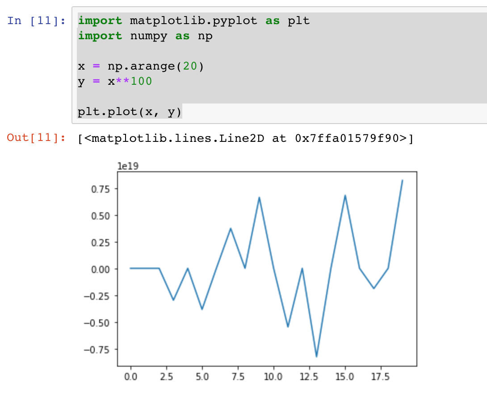

## [Kubeflow](https://github.com/kubeflow)
- 基于 [Kubernetes](https://kubernets.io) 和 [TensorFlow](https://tensorflow.org) 的机器学习流程工具
  - Kubernetes: 容器编排与管理服务软件
  - TensorFlow: 深度学习库
- 使用Ksonnet进行应用包的管理

## Google开源的机器学习包
- 微服务：简化在Kubernetes上运行机器学习的过程
- 按需部署：提供一个最佳开发系统，部署到任意的Kubernetes集群中
- 可重复：确保机器学习应用在集群之间无缝迁移
- 笔记本->训练集群->生产集群

## 主要组件
- Jupyter Notebook：JupyterHub创建和管理交互式Jupyter笔记本。 Jupyter本身支持跨所有编程语言的交互式数据科学和科学计算。
- TF Job Operator Controller：TensorFlow训练管理控制器，可以配置使用CPU或者GPU，并且动态调整训练集群的规模
  - Tensorflow
  - Pytorch
  - MPI
  - MXnet
  - Chainer  
- TF Serving：TensorFlow服务将训练好的模型以grpc和REST的方式提供API调用
- Argo 基于K8s的工作流引擎
- Ambassador 访问kubeflow组件

## Ksonnet用于简化Kubernetes部署配置方式
- 根据需求定制部署清单
- 部署多个不同环境
- 对比不同环境的版本差异
- 追踪不同环境版本配置

## Argo

argo是一个开源的基于容器的工作流引擎，并实现为一个K8S的CRD。

- 用容器实现工作流的每一个步骤
- 用DAG的形式描述多个任务之间的关系的依赖
- 支持机器学习和数据处理中的计算密集型任务
- 无需复杂配置就可以在容器中运行CICD


## Jupyter

Jupyter Notebook是深受数据科学家喜爱的开发工具，它提供出色的交互和实时反馈。JupyterHub提供一个使用Juypter Notebook的多用户使用环境.



## Ambassador 

提供了一个API网管，用于对kueflow的组件进行访问。


## Tensorflow 训练+服务


## Tensorboard

 

## Example

This example guides you through the process of taking an example model, modifying it to run better within Kubeflow, and serving the resulting trained model. We will be using Argo to manage the workflow, Tensorflow's S3 support for saving model training info, Tensorboard to visualize the training, and Kubeflow to deploy the Tensorflow operator and serve the model.

### 预制条件
- Kubernetes或者ICP集群

### Setup Kubeflow

#### 1. Download ksonnet

```
curl -fksSL https://github.com/ksonnet/ksonnet/releases/download/v0.13.0/ks_0.13.0_linux_amd64.tar.gz | tar --strip-components=1 -xvz -C /usr/local/bin/ ks_0.13.0_linux_amd64/ks
```

#### 2. Install kubeflow

```
git clone -b v0.3.2 https://github.com/kubeflow/kubeflow
./kubeflow/scripts/kfctl.sh init kf-app --platform none
cd kf-app
../kubeflow/scripts/kfctl.sh generate k8s
../kubeflow/scripts/kfctl.sh apply k8s
```

#### 3. Setup Minio 提供S3存储服务

##### Deploy Minio

```
docker run --name=minio --net=host -e MINIO_ACCESS_KEY=minio -e MINIO_SECRET_KEY=minio123 -d -v /var/lib/minio:/data siji/minio server /data
```

The Minio access key is `minio`, secret key is `minio123`.


##### Create Minio bucket，用于存储训练数据

```
mkdir /var/lib/minio/tfmnist
```

**OR**

Open Minio dashbaord in browser: http://minio-host:9000

Create bucket: `tfmnist`


##### 4. Download argo，管理工作流

```
curl -sSL -o /usr/local/bin/argo https://github.com/argoproj/argo/releases/download/v2.2.1/argo-linux-amd64
chmod +x /usr/local/bin/argo
```

##### 5.训练数据

```
export S3_DATA_URL=s3://${BUCKET_NAME}/data/mnist/
export S3_TRAIN_BASE_URL=s3://${BUCKET_NAME}/models
export JOB_NAME=myjob-$(uuidgen  | cut -c -5 | tr '[:upper:]' '[:lower:]')
export TF_MODEL_IMAGE=siji/mnist-model:v1.11.0
export TF_WORKER=3
export MODEL_TRAIN_STEPS=200

argo submit model-train.yaml -n ${NAMESPACE} --serviceaccount tf-user \
    -p aws-endpoint-url=${AWS_ENDPOINT_URL} \
    -p s3-endpoint=${S3_ENDPOINT} \
    -p aws-region=${AWS_REGION} \
    -p tf-model-image=${TF_MODEL_IMAGE} \
    -p s3-data-url=${S3_DATA_URL} \
    -p s3-train-base-url=${S3_TRAIN_BASE_URL} \
    -p job-name=${JOB_NAME} \
    -p tf-worker=${TF_WORKER} \
    -p model-train-steps=${MODEL_TRAIN_STEPS} \
    -p s3-use-https=${S3_USE_HTTPS} \
    -p s3-verify-ssl=${S3_VERIFY_SSL} \
    -p namespace=${NAMESPACE}
```

Your training workflow should now be executing.

You can verify and keep track of your workflow using the argo commands:

```
$ argo -n ${NAMESPACE} list
NAME                STATUS    AGE   DURATION
tf-workflow-h7hwh   Running   1h    1h

$ argo -n ${NAMESPACE} get tf-workflow-h7hwh
```

After the STATUS to `Succeeded`, then you can use it.

##### 6. Submit and query result，访问MNIST服务

By default the workflow deploys our model via Tensorflow Serving. Included in this example is a client that can query your model and provide results:

```
SERVICE_IP=$(kubectl -n ${NAMESPACE} get service -l app=mnist-${JOB_NAME} -o jsonpath='{.items[0].spec.clusterIP}')
TF_MODEL_SERVER_HOST=$SERVICE_IP TF_MNIST_IMAGE_PATH=data/7.png python mnist_client.py
```

This should result in output similar to this, depending on how well your model was trained:
```
outputs {
  key: "classes"
  value {
    dtype: DT_UINT8
    tensor_shape {
      dim {
        size: 1
      }
    }
    int_val: 7
  }
}
outputs {
  key: "predictions"
  value {
    dtype: DT_FLOAT
    tensor_shape {
      dim {
        size: 1
      }
      dim {
        size: 10
      }
    }
    float_val: 0.0
    float_val: 0.0
    float_val: 0.0
    float_val: 0.0
    float_val: 0.0
    float_val: 0.0
    float_val: 0.0
    float_val: 1.0
    float_val: 0.0
    float_val: 0.0
  }
}


............................
............................
............................
............................
............................
............................
............................
..............@@@@@@........
..........@@@@@@@@@@........
........@@@@@@@@@@@@........
........@@@@@@@@.@@@........
........@@@@....@@@@........
................@@@@........
...............@@@@.........
...............@@@@.........
...............@@@..........
..............@@@@..........
..............@@@...........
.............@@@@...........
.............@@@............
............@@@@............
............@@@.............
............@@@.............
...........@@@..............
..........@@@@..............
..........@@@@..............
..........@@................
............................
Your model says the above number is... 7!
```

You can also omit `TF_MNIST_IMAGE_PATH`, and the client will pick a random number from the mnist test data. Run it repeatedly and see how your model fares!


##### 6.Bring JupyterHub up

Change the `ambassador` service type to `NodePort`, then access JupyterHub throgh ambassador.

```
kubectl -n kubeflow patch service ambassador -p '{"spec": {"type": "NodePort"}}'
kubectl -n kubeflow get service ambassador
```

Then you will find the NodePort and access it by NodePort, use any username and password to login, such as `admin/admin`.

Create a PV in order to bring up a Jupyter NoteBook:

```
---
apiVersion: v1
kind: PersistentVolume
metadata:
  name: jupyter-pv
spec:
  capacity:
    storage: 40Gi
  accessModes:
  - ReadWriteOnce
  persistentVolumeReclaimPolicy: Retain
  # storageClassName: pets
  local:
    path: /var/pv/jupyter
  nodeAffinity:
    required:
      nodeSelectorTerms:
      - matchExpressions:
        - key: kubernetes.io/hostname
          operator: In
          values:
          - 172.16.183.209
```

## Defining your training workflow

This is the bulk of the work, let's walk through what is needed:

1. Train the model
1. Serve the model

Now let's look at how this is represented in our [example workflow](model-train.yaml)

The argo workflow can be daunting, but basically our steps above extrapolate as follows:

1. `get-workflow-info`: Generate and set variables for consumption in the rest of the pipeline.
1. `tensorboard`: Tensorboard is spawned, configured to watch the S3 URL for the training output.
1. `train-model`: A TFJob is spawned taking in variables such as number of workers, what path the datasets are at, which model container image, etc. The model is exported at the end.
1. `serve-model`: Optionally, the model is served.

With our workflow defined, we can now execute it.


## Argo UI

The Argo UI is useful for seeing what stage your worfklow is in:

```
PODNAME=$(kubectl -n kubeflow get pod -l app=argo-ui -o jsonpath='{.items[0].metadata.name}')
kubectl port-forward ${PODNAME} 8001:8001
```

You should now be able to visit [http://127.0.0.1:8001](http://127.0.0.1:8001) to see the status of your workflows.

## Tensorboard

Tensorboard is deployed just before training starts. To connect:

```
PODNAME=$(kubectl -n ${NAMESPACE} get pod -l app=tensorboard-${JOB_NAME} -o jsonpath='{.items[0].metadata.name}')
kubectl port-forward ${PODNAME} 6006:6006
```

Tensorboard can now be accessed at [http://127.0.0.1:6006](http://127.0.0.1:6006).
